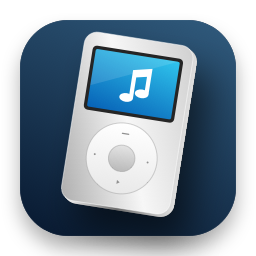
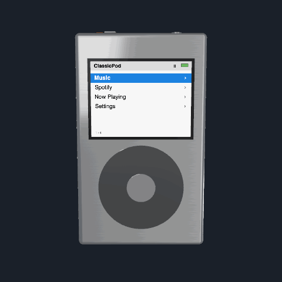

# ClassicPod



**Музыка в объёмном ретро-плеере на рабочем столе Mac.**

Native macOS music player with a fully rotatable 3D body, click wheel, local audio and Spotify Connect. Swift 6 · macOS 14+ · **0.3.0 beta** · [MIT](LICENSE). [English guide](docs/README.en.md).



Демонстрационный рендер реальной геометрии приложения: без аккаунта Spotify, музыки и сторонних обложек. В приложении корпус вращается мышью, экран интерактивный.

### Возможности

- Прозрачное окно, полный оборот корпуса, объёмные кнопки и разъёмы.
- Click wheel с шагами прокрутки и собственным синтезированным щелчком.
- Импорт локальных файлов и каталогов без копирования музыки.
- Spotify: Liked Songs, плейлисты и Connect; управление без Apple Events по умолчанию.
- SwiftUI + AppKit, SceneKit/SpriteKit, AVFoundation. Внешних пакетных зависимостей нет.

**Статус:** личная beta, не официальный продукт Apple или Spotify. Проверенная локальная сборка — Apple Silicon; deployment target macOS 14 не означает проверку на всех версиях macOS. Приложение не нотарифицировано. [Ограничения и проверки](VALIDATION.md) · [Изменения](CHANGELOG.md) · [Приватность](PRIVACY.md)
.

## Запуск

Нужен Mac и toolchain Swift 6 с macOS SDK. Соберите `.app` из корня проекта; результат появится в `dist/ClassicPod.app`. Бинарники не хранятся в Git. Если владелец опубликует готовые сборки, ищите их в Releases, а не среди исходников.

```sh
bash scripts/build-app.sh
open dist/ClassicPod.app
```

Для сборки достаточно актуальных Command Line Tools с macOS SDK. Для отладки в IDE и XCTest нужен полный Xcode с поддержкой Swift 6: откройте `ClassicPod.xcodeproj`, выберите схему ClassicPod → My Mac → Run. Автоматическая установка Xcode не выполнялась: она требует загрузки Apple и возможного входа/принятия условий пользователем. Не отключайте Gatekeeper глобально; эта сборка предназначена для локального использования.

`swift run ClassicPod` подходит для разработки, но для Automation запускайте `.app` со стабильным bundle identifier и Info.plist.

## Управление

В настройках доступен выбор **Язык / Language → Системный / English / Русский**. Выбор сохраняется между запусками. Меню, настройки, виртуальный экран и accessibility-подписи обновляются без сброса навигации, воспроизведения или ориентации. В системном режиме используется первый поддерживаемый язык macOS, иначе английский. Названия музыки, плейлистов и устройств не переводятся; системные диалоги и ошибки macOS следуют системному языку.

Прозрачное окно квадратное, до 720×720 points (адаптируется к дисплею). Камера оставляет запас для полного оборота корпуса, включая горизонтальное и диагональное положение.

- Перетаскивайте курсор по кольцу: 12° на шаг. Центральная область не прокручивает меню.
- MENU — назад; центр/Return — выбрать; нижняя зона/Space — Play/Pause; боковые зоны — Previous/Next.
- Стрелки вверх/вниз — прокрутка; в Now Playing колесо меняет громкость, Select переключает на перемотку с шагом 5 секунд.
- Перетаскивайте корпус для вращения на 360°. Option-drag перемещает окно. Escape возвращает фронтальный вид; следующий Escape — назад по меню. Правый клик — импорт, настройки, «Вид спереди», поверх окон, выход.
- В настройках можно отключить «Инерция вращения / Rotation Inertia». Лёгкое затухание останавливается новым касанием, Escape, скрытием окна или отключением настройки. При Reduce Motion в macOS инерция не используется. Выбор сохраняется между запусками.
- Файлы и папки можно бросить на окно. Импорт также доступен в меню Музыка и настройках.
- Настройки содержат список библиотеки и кнопку «Найти файл…» для восстановления ссылок.

## Spotify: настройка один раз

В 0.2.1 по умолчанию используется только Web API / Connect. При первой команде выбирается единственное активное доступное устройство, его ID закрепляется для следующих команд. Можно выбрать устройство вручную в меню Spotify. Требуются авторизация, Premium и сеть. При ошибке команда не пересылается локальному мосту.

Прямые Apple Events не предотвратили выход установленного Spotify на передний план: проблема повторно воспроизведена в 0.2.0. Поэтому мост оставлен только как явный режим «Локальный мост (может открыть окно)», не как режим по умолчанию. Для управления без этого пути используйте Connect, в том числе для Spotify на этом Mac. ClassicPod не скрывает клиент и не возвращает фокус принудительно.

1. Войдите в [Spotify Developer Dashboard](https://developer.spotify.com/dashboard), создайте приложение и получите **Client ID**, не Client Secret.
2. Добавьте точный Redirect URI: `http://127.0.0.1:43821/callback`.
3. Проверьте Premium владельца приложения и доступ тестового пользователя в Dashboard. У Development Mode есть отдельные ограничения аккаунтов и контента.
4. В настройках ClassicPod вставьте Client ID, нажмите «Авторизоваться», завершите вход в браузере. Локальный callback слушает только IPv4 loopback, проверяет state, завершается через 120 секунд или по кнопке отмены.
5. В меню Spotify откройте Liked Songs или плейлисты. Для удалённого воспроизведения сначала выберите Connect-устройство. Spotify должен иметь доступное устройство воспроизведения.
6. Необязательный legacy-режим: вручную откройте Spotify и выберите «Локальный мост (может открыть окно)». Только явное подключение может запросить Automation. Этот режим использует прямые Apple Events к PID запущенного Spotify; несмотря на `neverInteract`, клиент может самостоятельно выйти вперёд. Для отсутствия этого поведения оставьте Connect. При отказе Automation проверьте Системные настройки → Конфиденциальность и безопасность → Автоматизация.

Токены хранятся в Keychain, Client ID — в UserDefaults. Logout удаляет локальные токены; отзыв доступа на стороне Spotify выполняется в настройках аккаунта Spotify. Секреты не записываются в исходники или логи. Мост не скачивает музыку, не обходится без установленного клиента и не обходит ограничения Spotify Free. Без сети библиотека Web API не загружается; доступность музыки через мост определяется клиентом Spotify.

Scopes: `user-read-private`, `user-library-read`, `playlist-read-private`, `playlist-read-collaborative`, `user-read-playback-state`, `user-modify-playback-state`. Используется актуальный маршрут `/playlists/{id}/items`; декодер принимает `item` и прежнее `track`. POST-команды не повторяются после сетевого timeout; 401 допускает один refresh, 429 устанавливает cooldown по Retry-After.

## Архитектура

```text
SCNView / AppKit → InputEvent → AppStore / MenuNavigator
                                  ↓
                         PlaybackCoordinator
                         ├─ LocalPlaybackService → AVQueuePlayer
                         └─ SpotifyPlaybackService
                            ├─ SpotifyWebAPI → PKCE / Keychain
                            └─ SpotifyAppleEventBridge actor
                                  ↓
                         PlaybackSnapshot
                                  ↓
                         VirtualDisplay SKScene → NSImage → Screen material
```

- `Sources/PodCore`: Sendable-модели, колесо, навигация, quaternion arcball и выбор типа жеста; без UI/audio-зависимостей.
- `Sources/ClassicPod/App`, `Input`, `Scene`: окно, команды, доступность, PBR-корпус, SpriteKit-дисплей.
- `Library`: actor индексации и атомарное сохранение `~/Library/Application Support/ClassicPod/library.json`; файлы остаются на месте.
- `Playback`: backend-контракт, сериализация команд и переключение источников. Системные медиакоманды принадлежат ClassicPod только для локального источника.
- `Spotify`: OAuth, Web API, DTO, локальный мост и явный выбор транспорта. Команда не посылается одновременно обоим транспортам.

Импорт проверяет воспроизводимость AVFoundation, пропускает повреждённые файлы, не следует directory symlinks, использует bookmark для перемещённых файлов. Поддержка конкретных MP3/M4A/FLAC/WAV зависит от кодека внутри контейнера и системного декодера. Локальная очередь хранится отдельно от AVQueuePlayer; Previous после 3 секунд возвращает начало трека. Gapless и сквозное микширование не реализованы.


## Готовая 3D-модель

В версии 0.2 используется **собственная детализированная объёмная модель**: металлическая панель, хромированная спинка, шов, объёмные кнопки, разъёмы, Hold и гравировка. Вращается вся сборка; ближайшая видимая поверхность определяет жест, поэтому со спинки невозможно нажать колесо. Экран — живая текстура только лицевой стороны. Внешний ассет больше не требуется. Подробности: [ASSETS.md](ASSETS.md).

## Документация API

- [PKCE](https://developer.spotify.com/documentation/web-api/tutorials/code-pkce-flow)
- [Redirect URI](https://developer.spotify.com/documentation/web-api/concepts/redirect_uri)
- [Development Mode migration, February 2026](https://developer.spotify.com/documentation/web-api/tutorials/february-2026-migration-guide)
- [Playlist items](https://developer.spotify.com/documentation/web-api/reference/get-playlists-items)

Неофициальный личный проект; не связан с Apple или Spotify. Названия продуктов принадлежат их владельцам. Сторонние логотипы, музыка и оригинальные звуки iPod в репозитории отсутствуют.

## Разработка

Небольшие, сфокусированные изменения приветствуются. Инструкции и границы тестирования: [CONTRIBUTING.md](CONTRIBUTING.md). Предложения: сохранение состояния, shuffle/repeat, поиск по библиотеке и полировка материалов; это идеи, а не уже реализованные функции.

## Лицензия

Код и собственные ресурсы проекта распространяются по [MIT](LICENSE). Лицензия не распространяет права на стороннюю музыку, обложки и товарные знаки Apple/Spotify.
